# Measurement insights

Generated 2026-09-23 21:18 UTC from `insights/20260923T211831Z_smoke`.

- Profile: **smoke**
- Charts drawn: **31** of 31
- Runs considered: **8**
- Engines: cockroachdb, postgresql

Every chart resolves its inputs through the gated run loader, so a run that failed pre-flight or validation cannot appear in any figure here.

## Runs behind this report

| run id | engine | profile | phase |
|---|---|---|---|
| `20260923T203655Z_p1-network` | cockroachdb | smoke | network |
| `20260923T203817Z_bench_cluster` | cockroachdb | smoke | bench |
| `20260923T204006Z_p4-chaos-recover` | cockroachdb | smoke | chaos-recover |
| `20260923T204359Z_p4-chaos-dead` | cockroachdb | smoke | chaos-dead |
| `20260923T210315Z_p1-network` | postgresql | smoke | network |
| `20260923T210425Z_bench_cluster` | postgresql | smoke | bench |
| `20260923T210603Z_p4-chaos-recover` | postgresql | smoke | chaos-recover |
| `20260923T210911Z_p4-chaos-dead` | postgresql | smoke | chaos-dead |

## A - Benchmark and saturation

### A1. Throughput-latency curve

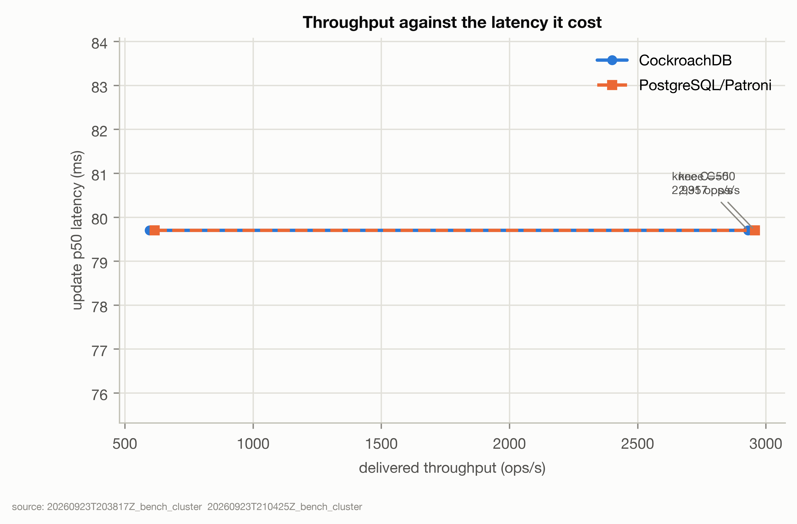

Each point is one concurrency tier. The curve bends upward at the knee, past which offered load buys queueing rather than throughput. Points are ordered by concurrency, not by throughput, because past saturation the curve genuinely bends backwards.

| metric | value |
|---|---|
| `cockroachdb_knee_concurrency` | 50 |
| `cockroachdb_knee_tps` | 2,931 |
| `cockroachdb_peak_tps` | 2,931 |
| `postgresql_knee_concurrency` | 50 |
| `postgresql_knee_tps` | 2,957 |
| `postgresql_peak_tps` | 2,957 |

### A2. Latency percentile fan

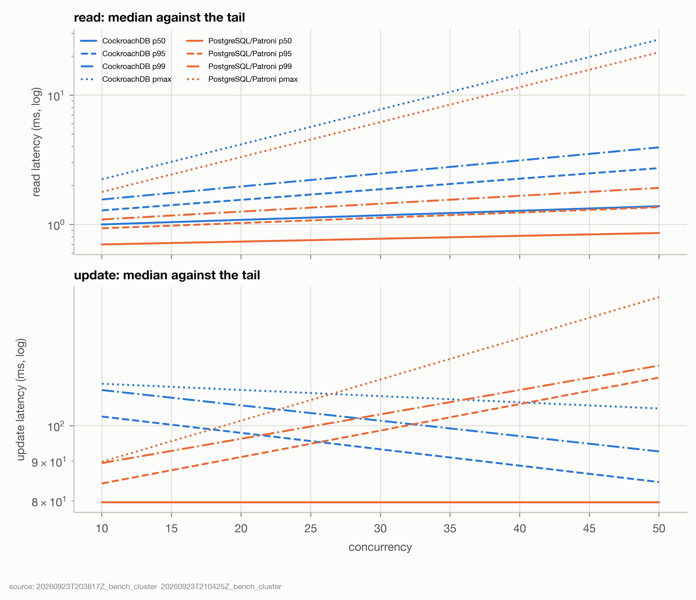

p50, p95, p99 and max for each operation type, per engine, on a log axis. A fan that opens with concurrency is queueing; one that stays parallel is a shifted floor. Operation types are never pooled.

| metric | value |
|---|---|
| `cockroachdb_read_p99_max_ms` | 3.94 |
| `postgresql_read_p99_max_ms` | 1.92 |
| `cockroachdb_update_p99_max_ms` | 111.2 |
| `postgresql_update_p99_max_ms` | 119.5 |

### A3. Concurrency slot occupancy

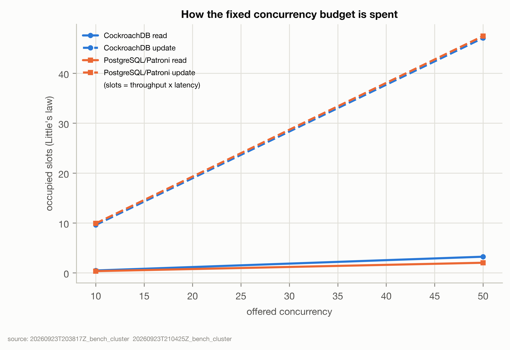

Little's law applied per operation type: an operation occupies throughput x latency of the client's fixed concurrency budget, and both factors are measured per operation rather than assumed from the configured mix. Where reads grow expensive they crowd out writes for the same slots, which is a different statement from either one simply being slow.

| metric | value |
|---|---|
| `cockroachdb_read_slots_at_max_c` | 3.2 |
| `cockroachdb_update_slots_at_max_c` | 47.1 |
| `postgresql_read_slots_at_max_c` | 2 |
| `postgresql_update_slots_at_max_c` | 47.5 |

### A4. Steady-state stability

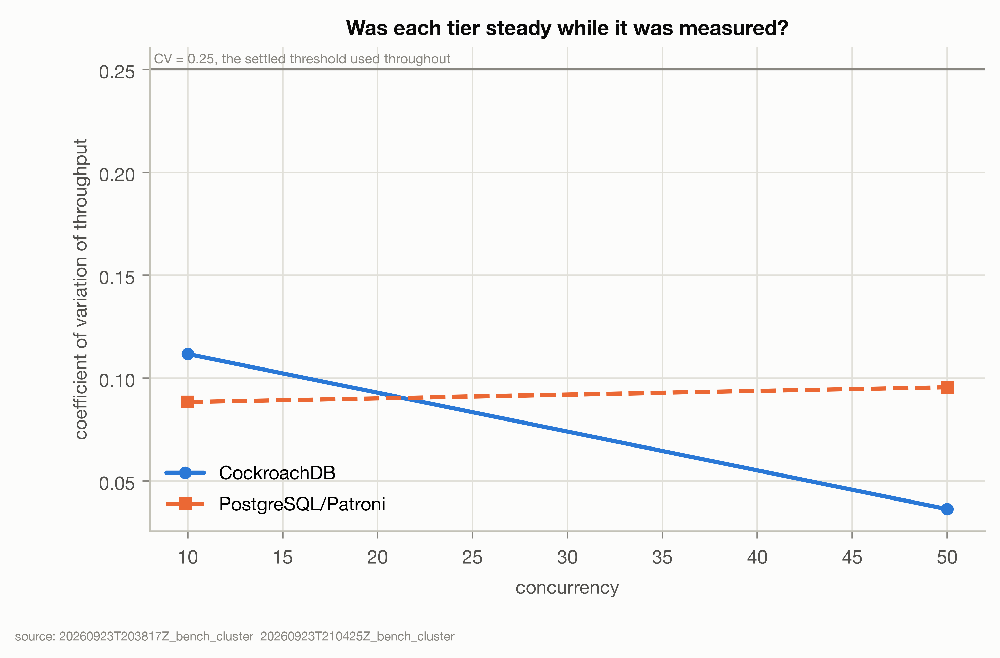

Within-tier coefficient of variation of throughput. A tier above the line was still moving while it was being recorded, and its mean is a average over a transient rather than a steady state.

| metric | value |
|---|---|
| `cockroachdb_max_cv` | 0.112 |
| `cockroachdb_worst_tier` | 10 |
| `postgresql_max_cv` | 0.095 |
| `postgresql_worst_tier` | 50 |

### A5. Error rate against load

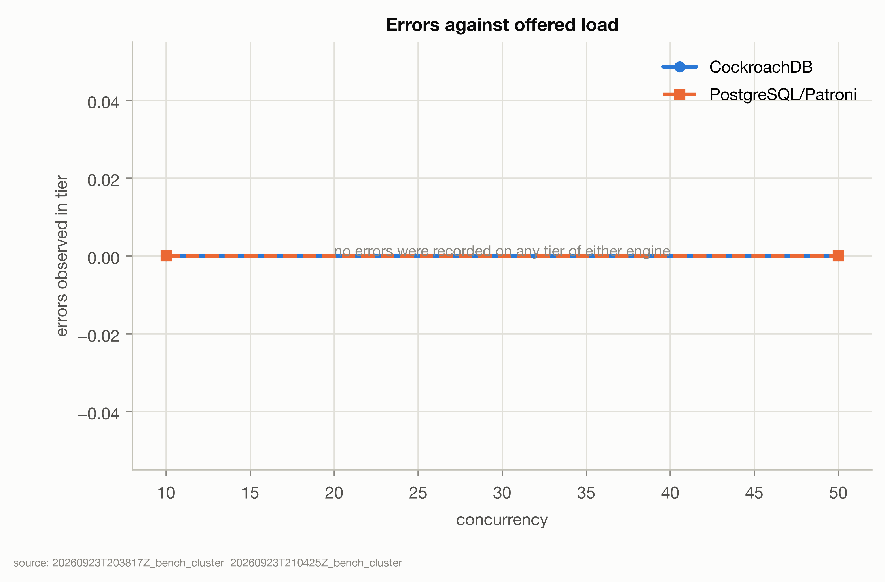

Errors per tier. The bench sweep runs without --tolerate-errors, so a non-zero count here would mean the generator survived something it was not configured to absorb; zero is the expected result and is what makes the throughput figures quotable.

| metric | value |
|---|---|
| `cockroachdb_errors_total` | 0 |
| `postgresql_errors_total` | 0 |

### A6. Throughput under a latency budget

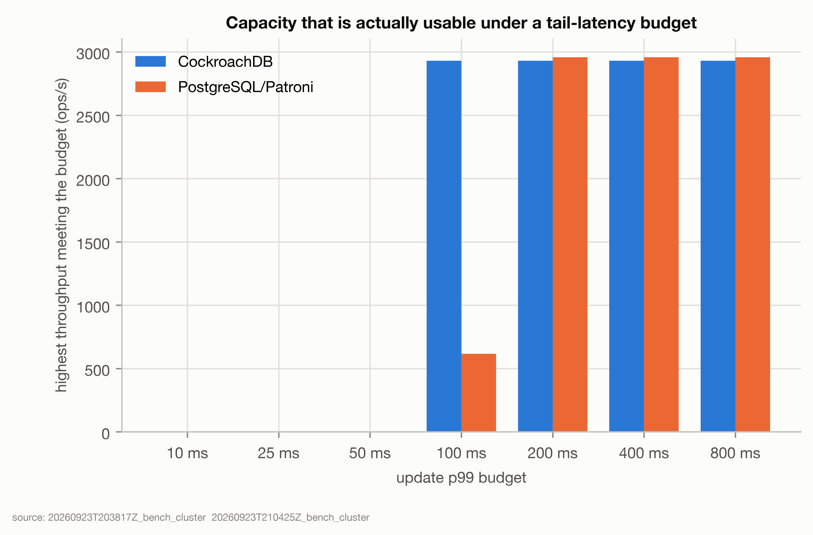

The highest measured throughput whose p99 stayed inside each budget. A zero bar means no tier met that budget at all. This restates the same tiers as A1 in the form a service owner buys: peak throughput at an unbounded tail is not deliverable capacity.

| metric | value |
|---|---|
| `cockroachdb_tps_under_p99_10ms` | 0 |
| `cockroachdb_tps_under_p99_25ms` | 0 |
| `cockroachdb_tps_under_p99_50ms` | 0 |
| `cockroachdb_tps_under_p99_100ms` | 2,931 |
| `cockroachdb_tps_under_p99_200ms` | 2,931 |
| `cockroachdb_tps_under_p99_400ms` | 2,931 |
| `cockroachdb_tps_under_p99_800ms` | 2,931 |
| `postgresql_tps_under_p99_10ms` | 0 |
| `postgresql_tps_under_p99_25ms` | 0 |
| `postgresql_tps_under_p99_50ms` | 0 |
| `postgresql_tps_under_p99_100ms` | 616.1 |
| `postgresql_tps_under_p99_200ms` | 2,957 |
| `postgresql_tps_under_p99_400ms` | 2,957 |
| `postgresql_tps_under_p99_800ms` | 2,957 |

### A7. Throughput by concurrency

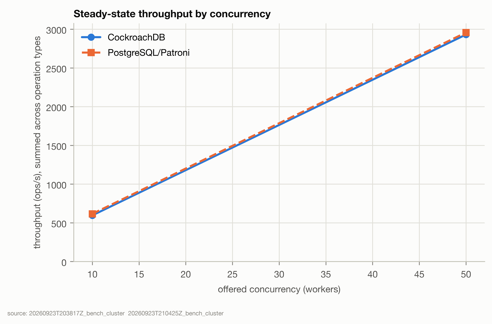

Mean throughput per tier against the concurrency that produced it. Flattening or falling back past some concurrency is saturation; A1 shows what that saturation costs in latency.

| metric | value |
|---|---|
| `cockroachdb_peak_tps` | 2,931 |
| `cockroachdb_peak_concurrency` | 50 |
| `postgresql_peak_tps` | 2,957 |
| `postgresql_peak_concurrency` | 50 |

## B - Hardware utilisation

### B1. Per-node CPU timeline

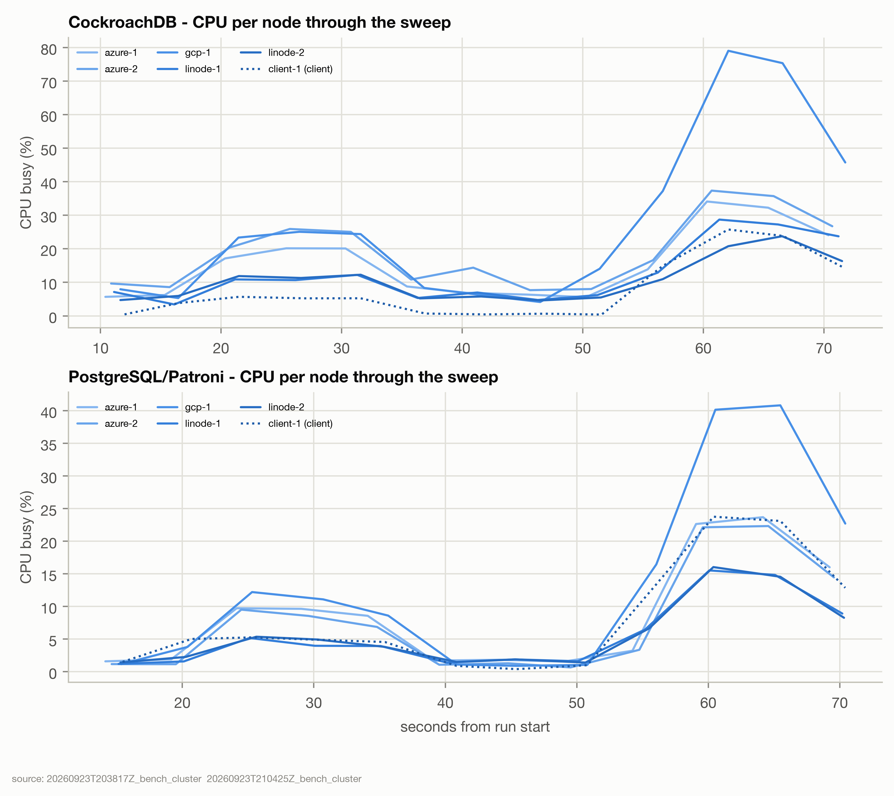

CPU busy per node across the benchmark sweep, one panel per engine. The client node is dotted and is not a cluster member; it is shown so a client-side bottleneck can be excluded rather than assumed away.

| metric | value |
|---|---|
| `cockroachdb_azure-1_cpu_mean_pct` | 15.5 |
| `cockroachdb_azure-2_cpu_mean_pct` | 19 |
| `cockroachdb_gcp-1_cpu_mean_pct` | 27.4 |
| `cockroachdb_linode-1_cpu_mean_pct` | 12.3 |
| `cockroachdb_linode-2_cpu_mean_pct` | 10.7 |
| `postgresql_azure-1_cpu_mean_pct` | 8.5 |
| `postgresql_azure-2_cpu_mean_pct` | 7.7 |
| `postgresql_gcp-1_cpu_mean_pct` | 13.3 |
| `postgresql_linode-1_cpu_mean_pct` | 5.5 |
| `postgresql_linode-2_cpu_mean_pct` | 5.7 |

### B2. CPU efficiency

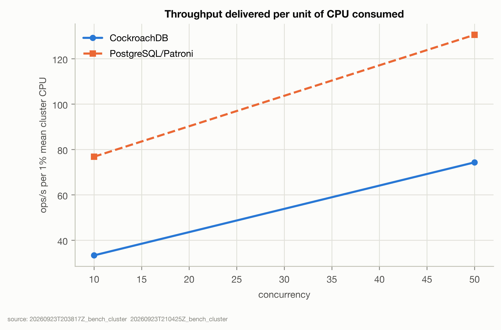

Delivered throughput divided by mean CPU busy across the five cluster nodes, per tier. This is the cost-of-replication figure that throughput alone cannot give: an engine can be faster and still be spending more machine to get there. The client node is excluded from the CPU mean.

| metric | value |
|---|---|
| `cockroachdb_c10_ops_per_cpu_pct` | 33.3 |
| `cockroachdb_c50_ops_per_cpu_pct` | 74.3 |
| `postgresql_c10_ops_per_cpu_pct` | 76.8 |
| `postgresql_c50_ops_per_cpu_pct` | 130.5 |

### B3. Disk I/O and busy time

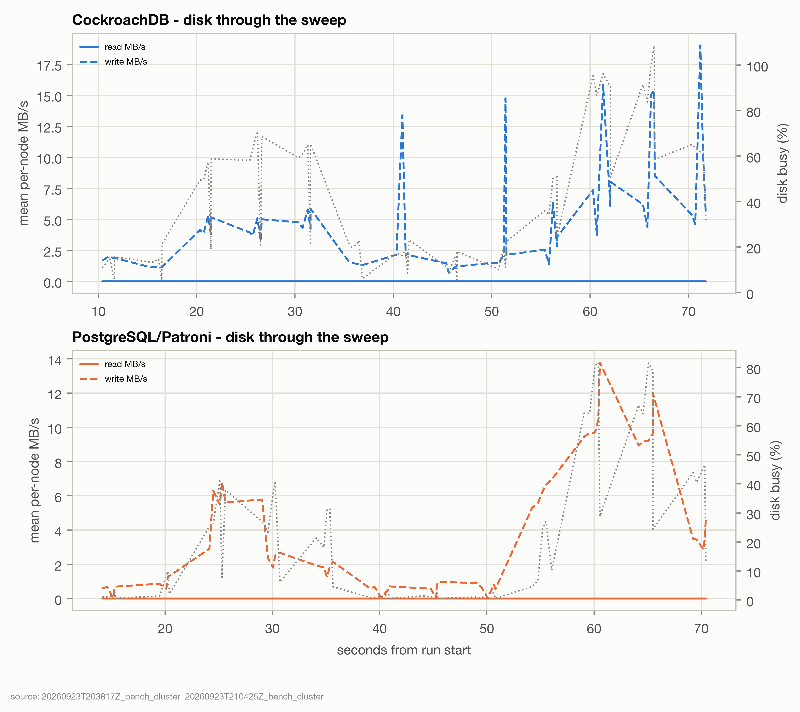

Mean per-node disk throughput and busy time across the cluster. At the current profile the working set is roughly 1.5x node RAM, so sustained read traffic here is the evidence that the benchmark is disk-bound rather than served from cache -- the assumption the whole profile rests on. A second axis carries busy %; it is dotted and grey because it is a different quantity, not a third series.

| metric | value |
|---|---|
| `cockroachdb_disk_busy_mean_pct` | 39.5 |
| `cockroachdb_disk_read_mean_mb_s` | 0 |
| `cockroachdb_disk_write_mean_mb_s` | 4.49 |
| `postgresql_disk_busy_mean_pct` | 22.1 |
| `postgresql_disk_read_mean_mb_s` | 0 |
| `postgresql_disk_write_mean_mb_s` | 3.63 |

### B4. Memory headroom

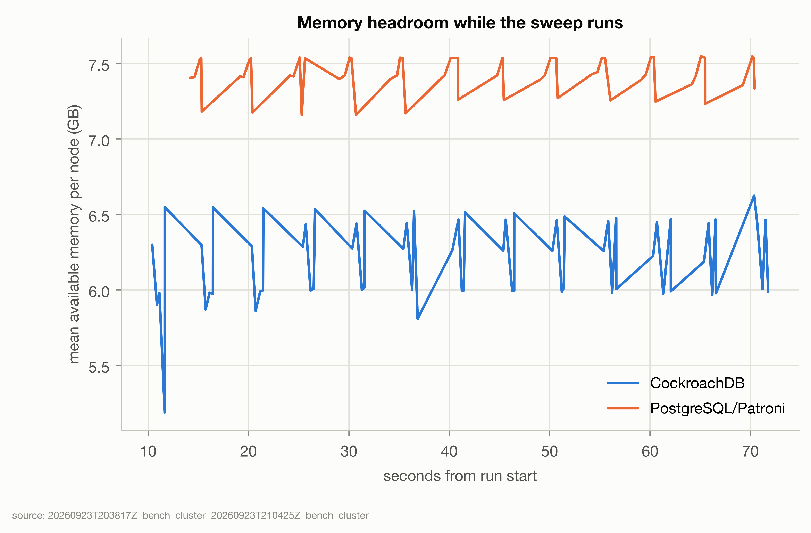

Mean available memory across the five cluster nodes. Both engines are configured with a cache of a quarter of measured RAM, so this shows the OS page cache absorbing the remainder -- and how little headroom is left once a working set larger than RAM is being served.

| metric | value |
|---|---|
| `cockroachdb_mem_available_min_gb` | 5.19 |
| `cockroachdb_mem_total_gb` | 8.32 |
| `postgresql_mem_available_min_gb` | 7.16 |
| `postgresql_mem_total_gb` | 8.32 |

### B5. Replication traffic amplification

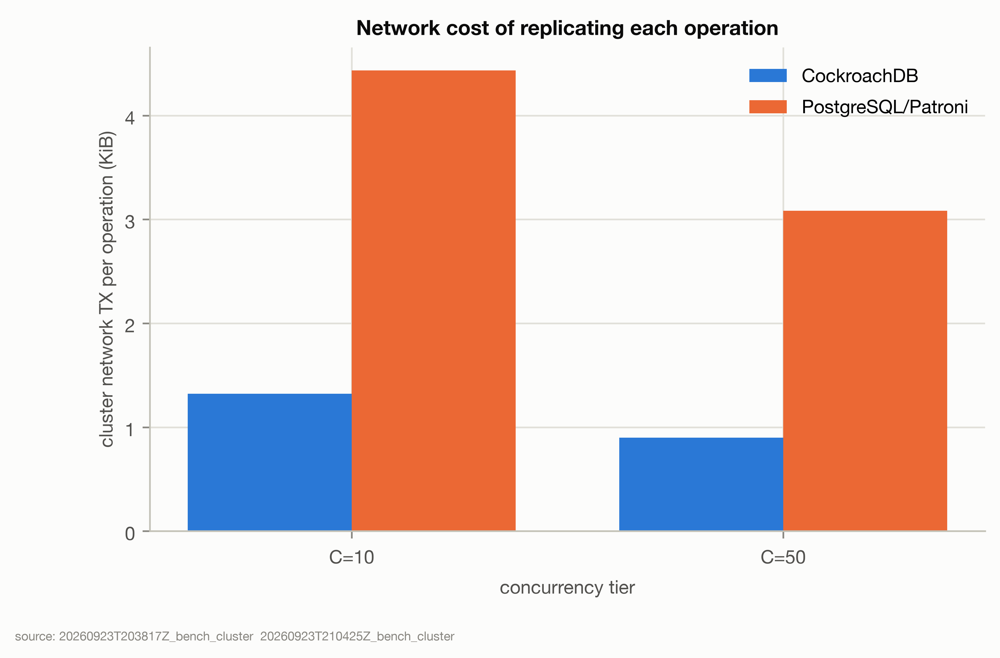

Total bytes transmitted by the five cluster nodes divided by the operations they served, per tier. This is the closest direct measurement the testbed makes of what each replication design costs on the wire -- Raft's per-range replication against Patroni's WAL streaming. It is a ratio of two measured rates, so it is insensitive to the tiers having different durations. Read it as an order of magnitude: the link also carries Tailscale and node exporter traffic, which is not separated out.

| metric | value |
|---|---|
| `cockroachdb_c10_tx_kib_per_op` | 1.32 |
| `cockroachdb_c50_tx_kib_per_op` | 0.9 |
| `postgresql_c10_tx_kib_per_op` | 4.43 |
| `postgresql_c50_tx_kib_per_op` | 3.08 |

### B6. Cluster utilisation heatmap

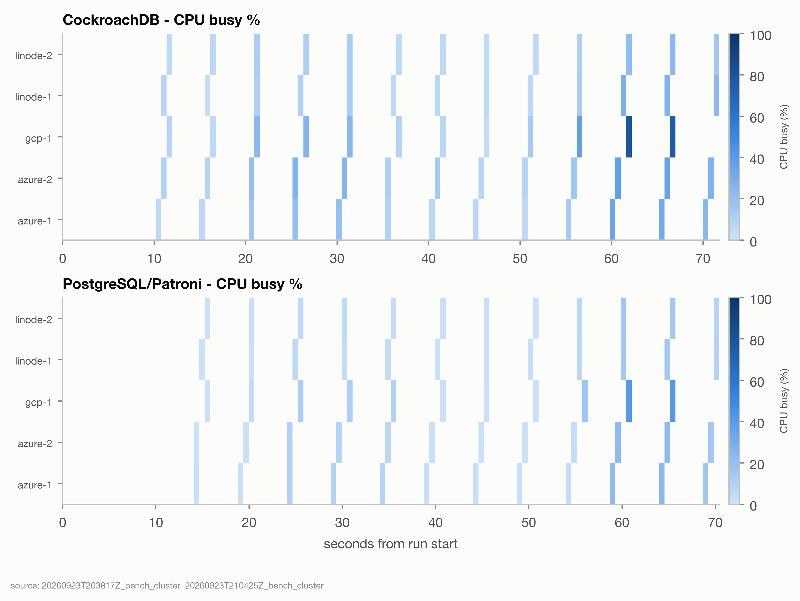

Every cluster node's CPU on one grid, binned onto a common time axis because the nodes are polled independently. A single bright row is a single busy machine; a uniformly lit panel is work spread across the cluster. One continuous hue, so brightness reads as magnitude rather than as category.

| metric | value |
|---|---|
| `cockroachdb_cpu_peak_pct` | 79.1 |
| `postgresql_cpu_peak_pct` | 40.8 |

### B7. Cluster load imbalance

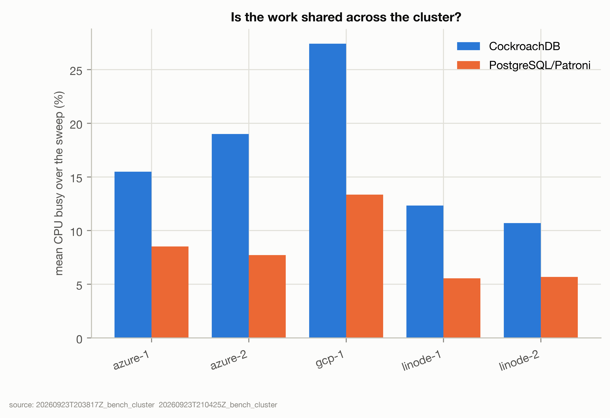

Mean CPU per cluster node over the whole sweep, with a scale-free coefficient of variation recorded alongside so that an engine which simply runs hotter everywhere is not counted as imbalanced. Read this against the deployment rather than against the engines' reputations: this testbed deliberately pins CockroachDB's leaseholders to the gateway via lease_preferences and pins Patroni's primary to the same node, so neither arm is free to spread work as it otherwise might. What the chart measures is how much of the cluster each engine still uses under that pinning, which is a property of this configuration and must be quoted as one.

| metric | value |
|---|---|
| `cockroachdb_cpu_imbalance_cv` | 0.35 |
| `cockroachdb_busiest_node` | gcp-1 |
| `postgresql_cpu_imbalance_cv` | 0.347 |
| `postgresql_busiest_node` | gcp-1 |

## C - Resilience

### C1. Probe attempt strip

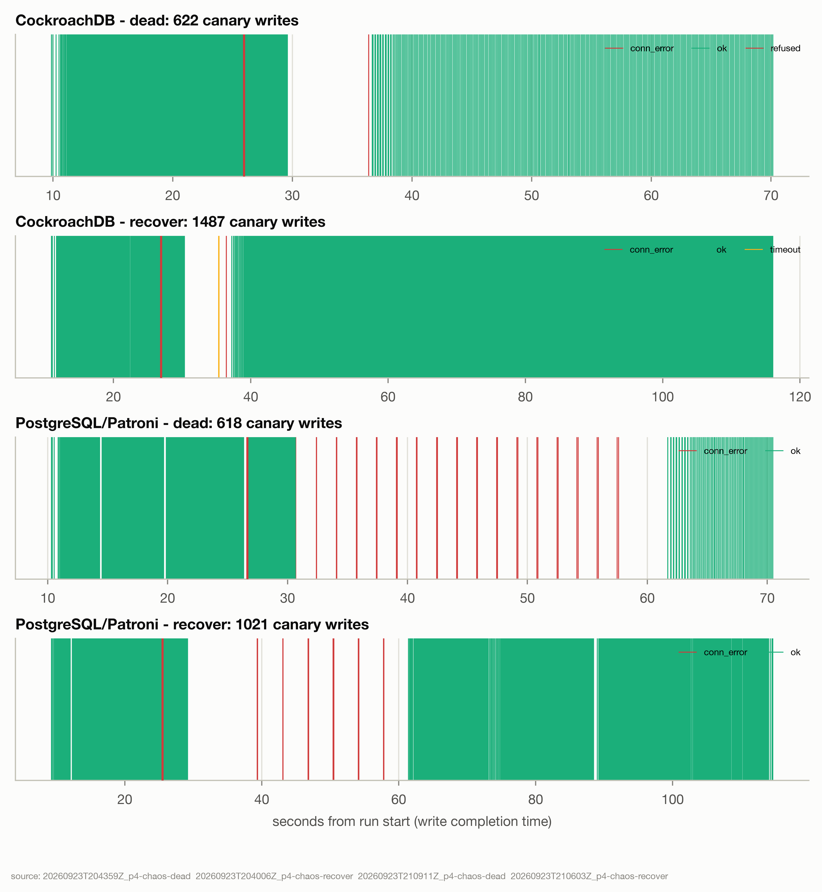

One vertical rule per canary write, placed at the moment it completed and coloured by outcome. The outage is the blank band: this is the outage as directly observed, with no statistic between the reader and the measurement. Writes are placed by completion time, never dispatch time.

| metric | value |
|---|---|
| `cockroachdb_dead_attempts` | 622 |
| `cockroachdb_dead_outcomes` | ok=620, refused=1, conn_error=1 |
| `cockroachdb_recover_attempts` | 1487 |
| `cockroachdb_recover_outcomes` | ok=1483, timeout=2, conn_error=2 |
| `postgresql_dead_attempts` | 618 |
| `postgresql_dead_outcomes` | ok=584, conn_error=34 |
| `postgresql_recover_attempts` | 1021 |
| `postgresql_recover_outcomes` | ok=1009, conn_error=12 |

### C2. Probe latency through the fault

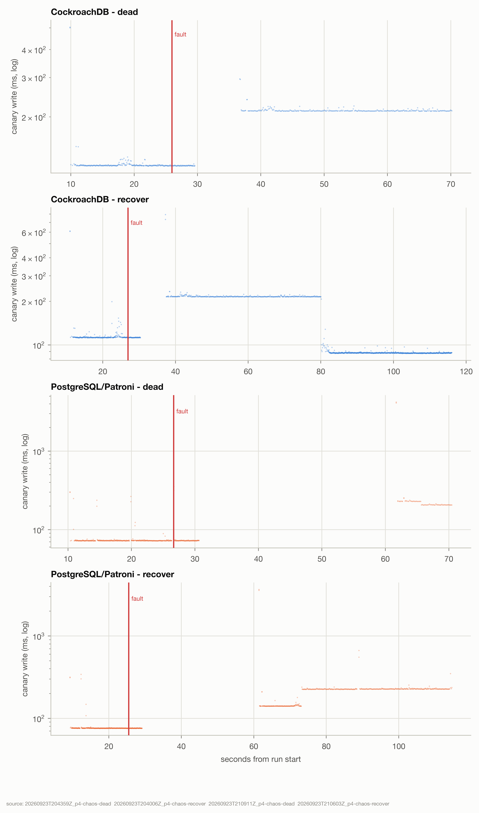

Duration of every served canary write, log scale. A step in the floor after the fault is a structural change in the write path -- the new primary or leaseholder is a different distance away -- and is a separate finding from how long writes were unavailable.

| metric | value |
|---|---|
| `cockroachdb_dead_pre_fault_p50_ms` | 121.3 |
| `cockroachdb_dead_post_fault_p50_ms` | 212.7 |
| `cockroachdb_recover_pre_fault_p50_ms` | 112.7 |
| `cockroachdb_recover_post_fault_p50_ms` | 88.46 |
| `postgresql_dead_pre_fault_p50_ms` | 72.42 |
| `postgresql_dead_post_fault_p50_ms` | 73.06 |
| `postgresql_recover_pre_fault_p50_ms` | 76.04 |
| `postgresql_recover_post_fault_p50_ms` | 225.6 |

### C3. Instrument agreement

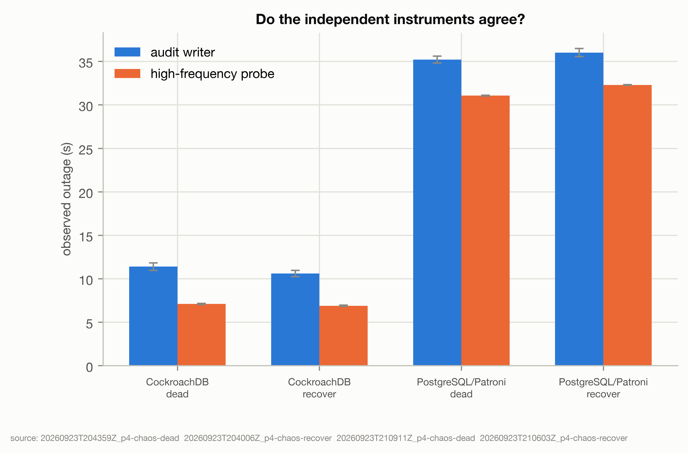

The same outage as measured by two instruments that share no code path, with each one's own sampling resolution drawn as its error bar. Agreement within those bars is the defensibility claim: a single instrument can be wrong in the flattering direction and nothing in its own output would show it.

| metric | value |
|---|---|
| `CockroachDB_dead` | audit_s=11.39, probe_s=7.099 |
| `CockroachDB_recover` | audit_s=10.6, probe_s=6.892 |
| `PostgreSQL/Patroni_dead` | audit_s=35.2, probe_s=31.06 |
| `PostgreSQL/Patroni_recover` | audit_s=36.01, probe_s=32.29 |

### C4. Recovery decomposition

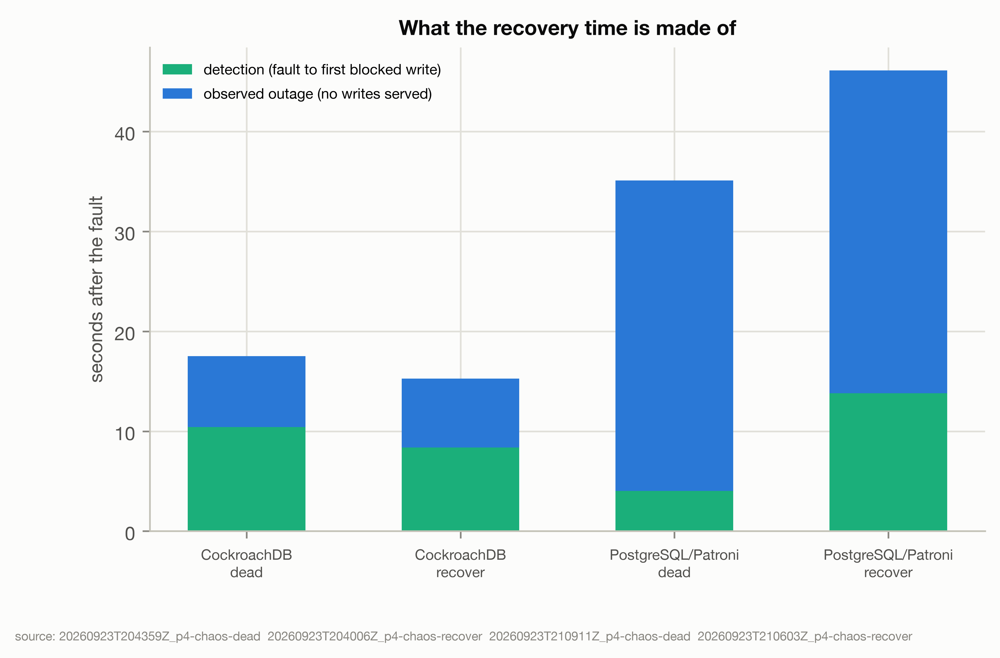

The interval from the fault to the first blocked write is detection, not recovery -- the injected command returns before established connections stop working, so writes continue briefly after the fault is nominally in place. Separating the two prevents a fast failover from being credited with a slow detection.

| metric | value |
|---|---|
| `CockroachDB_dead` | detection_s=10.42, outage_s=7.099 |
| `CockroachDB_recover` | detection_s=8.38, outage_s=6.892 |
| `PostgreSQL/Patroni_dead` | detection_s=4.026, outage_s=31.06 |
| `PostgreSQL/Patroni_recover` | detection_s=13.81, outage_s=32.29 |

### C5. Post-fault settling

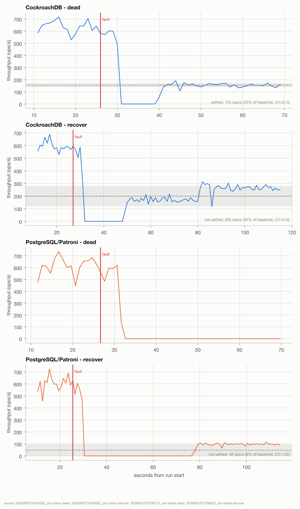

Throughput through the fault, with the post-fault mean and its one-sigma band. The verdict is the harness's own: a run whose coefficient of variation stays above 0.25 has not settled, and no recovery time can be stated for it -- which is a result to report, not a missing number.

| metric | value |
|---|---|
| `cockroachdb_dead` | settled=True, mean_tps=155.4, fraction_of_baseline=0.2453, cv=0.1037 |
| `cockroachdb_recover` | settled=False, mean_tps=199.5, fraction_of_baseline=0.3352, cv=0.4047 |
| `postgresql_recover` | settled=False, mean_tps=48.1, fraction_of_baseline=0.0796, cv=1.015 |

### C6. Read and write paths after failover

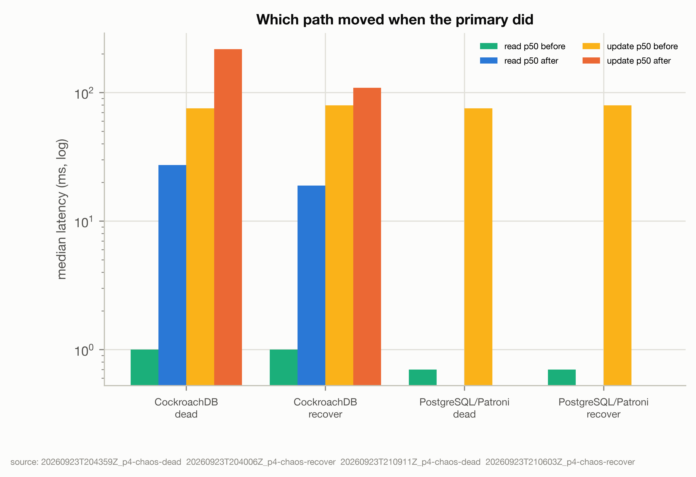

Read and update medians either side of the fault, log scale. This is the asymmetry the cross-engine write-up must quote carefully: PostgreSQL's clients follow the primary through HAProxy, so a promotion into another region moves the read path too -- and reads are 80% of this workload. A throughput RTO that never resolves is then a statement about where the new primary landed, not about the write path, and must be quoted with these read medians beside it.

| metric | value |
|---|---|
| `cockroachdb_dead` | read_p50_before_ms=1, read_p50_after_ms=27.3, update_p50_before_ms=75.5, update_p50_after_ms=218.1 |
| `cockroachdb_recover` | read_p50_before_ms=1, read_p50_after_ms=18.9, update_p50_before_ms=79.7, update_p50_after_ms=109.1 |
| `postgresql_dead` | read_p50_before_ms=0.7, read_p50_after_ms=0, update_p50_before_ms=75.5, update_p50_after_ms=0 |
| `postgresql_recover` | read_p50_before_ms=0.7, read_p50_after_ms=0, update_p50_before_ms=79.7, update_p50_after_ms=0 |

### C7. Hardware through the failover

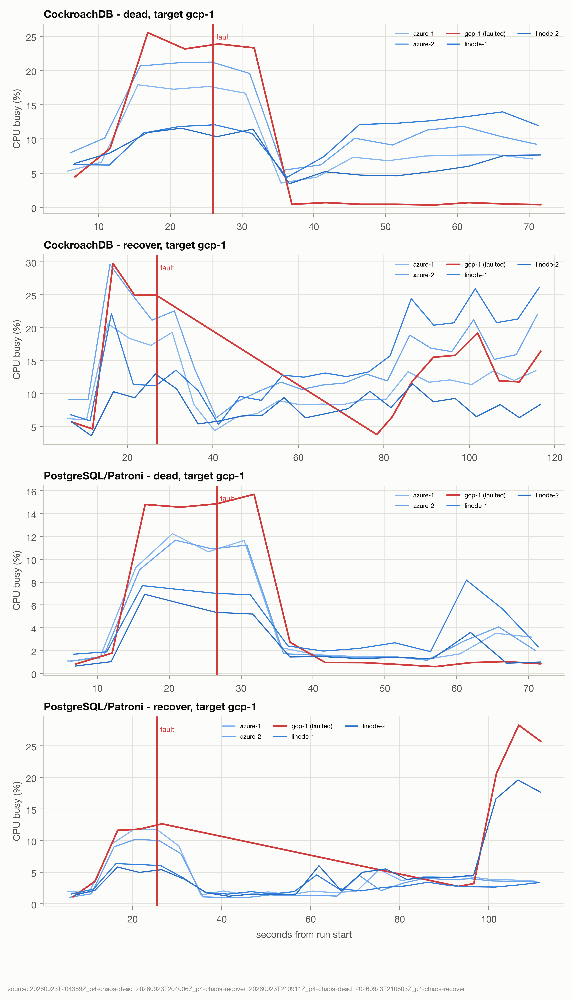

Per-node CPU across the fault, with the faulted node in the reserved status colour. The faulted node going quiet confirms the fault landed on the machine it was aimed at, and a survivor rising afterwards is the promotion visible in hardware rather than inferred from the database's own logs.

| metric | value |
|---|---|
| `cockroachdb_dead_target` | gcp-1 |
| `cockroachdb_recover_target` | gcp-1 |
| `postgresql_dead_target` | gcp-1 |
| `postgresql_recover_target` | gcp-1 |

### C8. RTO and RPO summary

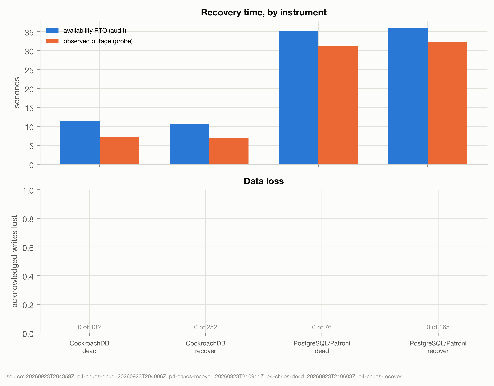

Recovery time from both instruments and acknowledged writes lost, for every engine and fault class. RPO zero is the expected result for a quorum-replicated database and is meaningful only because the measurement could have shown otherwise: the audit client records what it was told committed and advances past ambiguous writes rather than retrying them.

| metric | value |
|---|---|
| `CockroachDB_dead` | availability_rto_s=11.39, probe_outage_s=7.099, rpo_lost=0, rpo_acknowledged=132 |
| `CockroachDB_recover` | availability_rto_s=10.6, probe_outage_s=6.892, rpo_lost=0, rpo_acknowledged=252 |
| `PostgreSQL/Patroni_dead` | availability_rto_s=35.2, probe_outage_s=31.06, rpo_lost=0, rpo_acknowledged=76 |
| `PostgreSQL/Patroni_recover` | availability_rto_s=36.01, probe_outage_s=32.29, rpo_lost=0, rpo_acknowledged=165 |

## D - Engine comparison

### D1. Engine throughput-latency curves

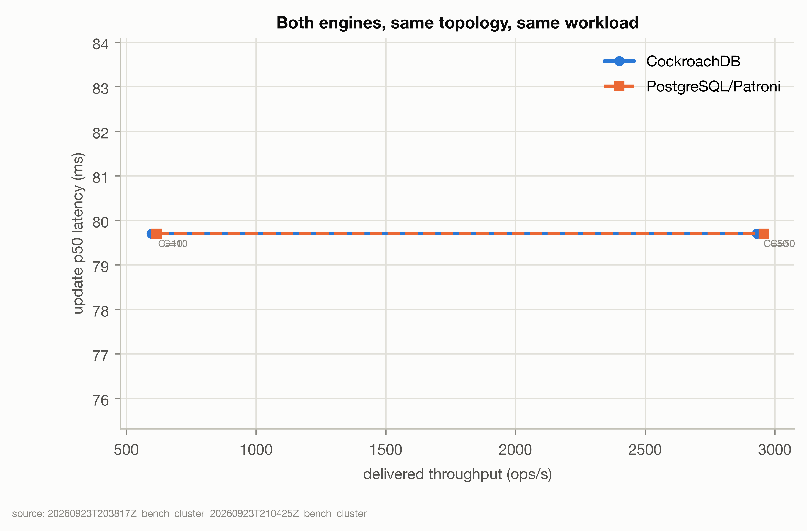

Each engine's own curve, annotated with the concurrency that produced each point. Read the horizontal distance as capacity and the vertical as cost; quote the saturation point rather than a single ratio, because the gap between the curves depends entirely on where along them it is measured.

| metric | value |
|---|---|
| `cockroachdb_peak_tps` | 2,931 |
| `cockroachdb_peak_concurrency` | 50 |
| `cockroachdb_saturated` | False |
| `postgresql_peak_tps` | 2,957 |
| `postgresql_peak_concurrency` | 50 |
| `postgresql_saturated` | False |

### D2. Latency at matched throughput

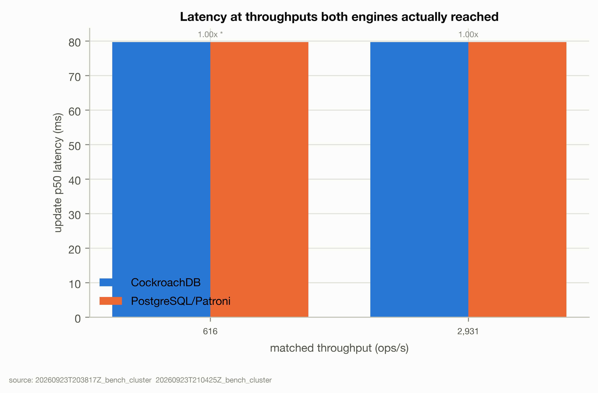

Both engines evaluated at throughputs each of them genuinely measured -- no extrapolation beyond either curve. The ratio above each pair is the overhead at that load; the starred point is the least confounded one, where the two engines were closest to the same fraction of their own capacity. Do not quote the largest ratio: it is the one where the slower engine is nearest saturation and so carries the most of its own queueing.

| metric | value |
|---|---|
| `points` | 2 entries |
| `least_confounded` | throughput_tps=616.1, phase_ii_latency_ms=79.7, phase_iii_latency_ms=79.7, overhead_x=1, phase_ii_utilisation=0.21, phase_iii_utilisation=0.208, utilisation_gap=0.002, measured_in=PostgreSQL |

### D3. Latency at matched utilisation

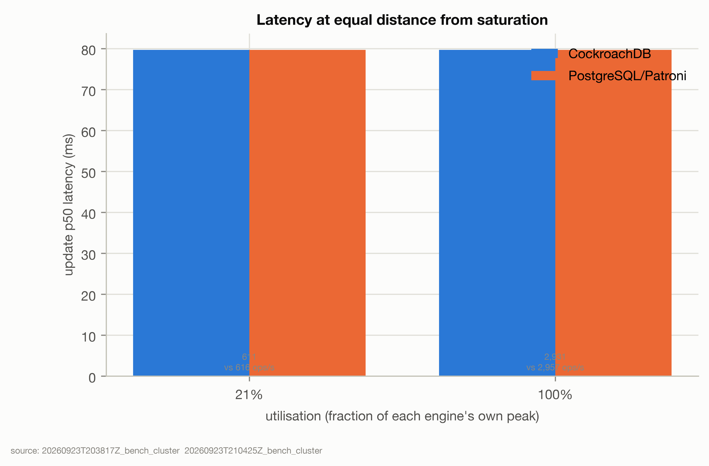

The engines held at the same fraction of their own measured capacity, so their queueing components are comparable and the residual is closer to the replication path alone. The throughputs beneath each pair are deliberately different -- that is what this framing holds variable -- so these bars must never be quoted as a cost at any particular ops/s.

| metric | value |
|---|---|
| `points` | 2 entries |
| `phase_ii_peak_tps` | 2,931 |
| `phase_iii_peak_tps` | 2,957 |

### D4. Engine scorecard

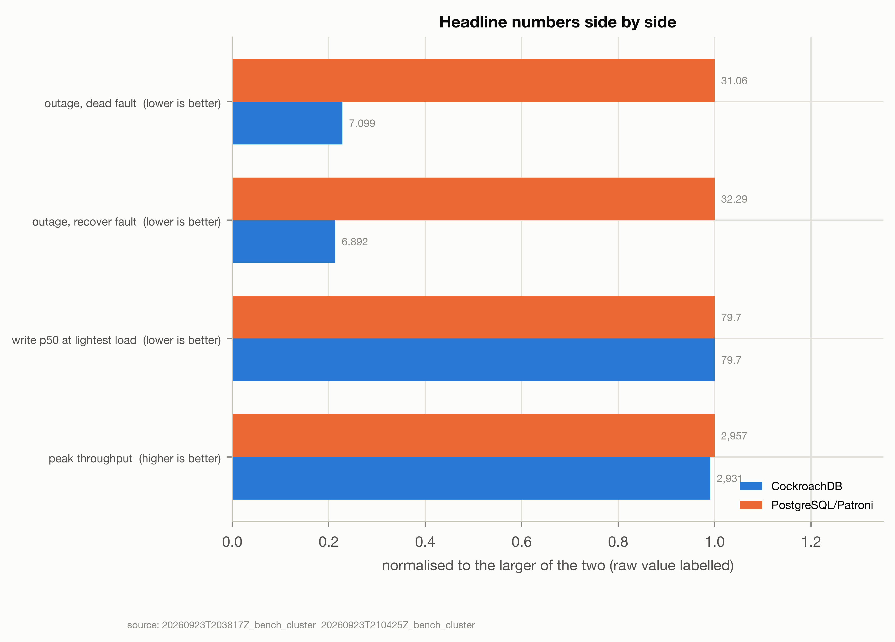

Each row normalised to the larger of the two values so that quantities in different units share an axis; the raw value is printed beside every bar because the normalised length alone is not quotable. The direction that counts as better differs by row and is stated on each one.

| metric | value |
|---|---|
| `peak throughput` | cockroachdb=2,931, postgresql=2,957 |
| `write p50 at lightest load` | cockroachdb=79.7, postgresql=79.7 |
| `outage, recover fault` | cockroachdb=6.892, postgresql=32.29 |
| `outage, dead fault` | cockroachdb=7.099, postgresql=31.06 |

### D5. Cost of consistency

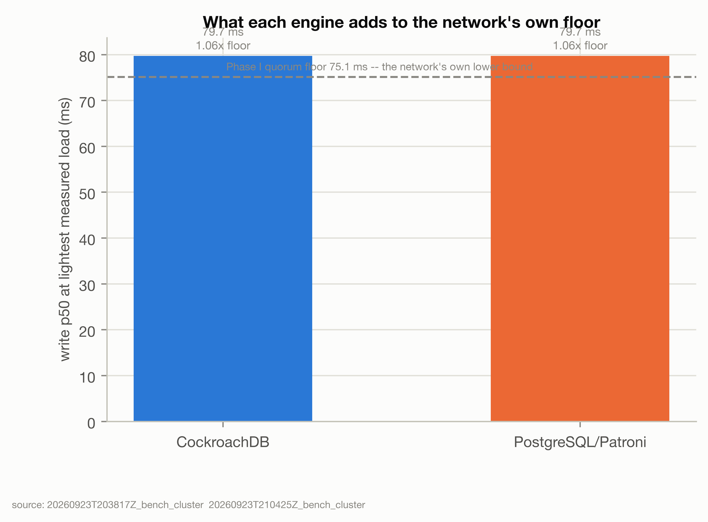

Each engine's write median at its lightest measured load, against the quorum floor measured independently by ping in Phase I. The floor is what the speed of light and this topology cost before any database is involved -- a 3-of-5 Raft quorum and Patroni's ANY 2 acknowledgement are the same geometry -- so the excess above it is the software's own contribution. Taken at the lightest load because that is where queueing contributes least.

| metric | value |
|---|---|
| `quorum_floor_ms` | 75.12 |
| `CockroachDB_write_p50_ms` | 79.7 |
| `CockroachDB_x_over_floor` | 1.061 |
| `PostgreSQL/Patroni_write_p50_ms` | 79.7 |
| `PostgreSQL/Patroni_x_over_floor` | 1.061 |

## E - Network and provenance

### E1. Quorum floor derivation

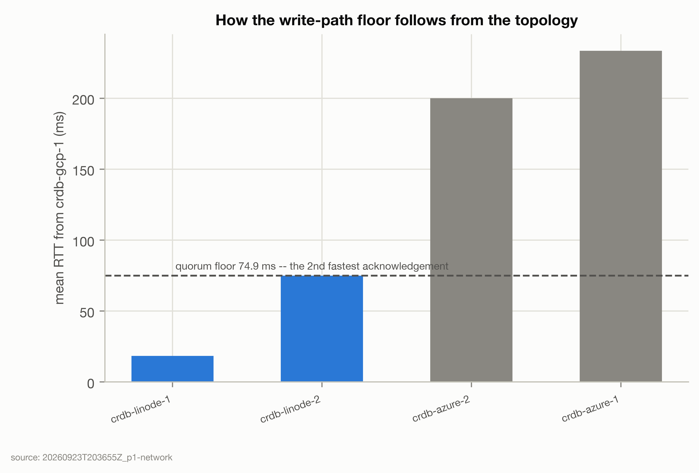

Round-trip time from the gateway to every other node, sorted. A write commits once the leader and the two fastest acknowledgements have it, so the second bar sets the floor and the slower nodes do not gate an ordinary commit at all. Measured with ping, so it is independent of both databases -- which is what lets it bound them.

| metric | value |
|---|---|
| `gateway` | crdb-gcp-1 |
| `recorded_quorum_floor_ms` | 74.91 |
| `derived_floor_ms` | 74.91 |

### E2. Link stability

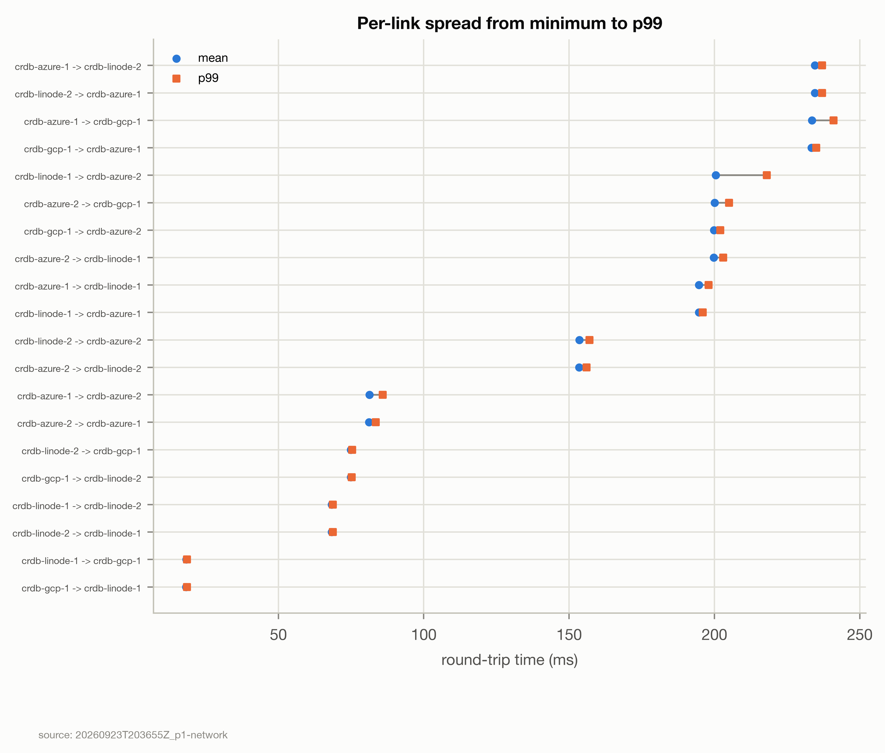

Minimum to p99 for every ordered pair. A short bar is a link whose mean is a real description of it; a long one is a link whose mean is an average over two different behaviours, and any latency figure resting on it inherits that spread. Note that ping's printed precision degrades as RTT grows -- each link's own resolution is recorded in network.csv.

| metric | value |
|---|---|
| `links` | 20 |
| `max_spread_ms` | 18.62 |
| `worst_link` | crdb-linode-1 -> crdb-azure-2 |
| `max_loss_pct` | 0 |

### E3. Run provenance

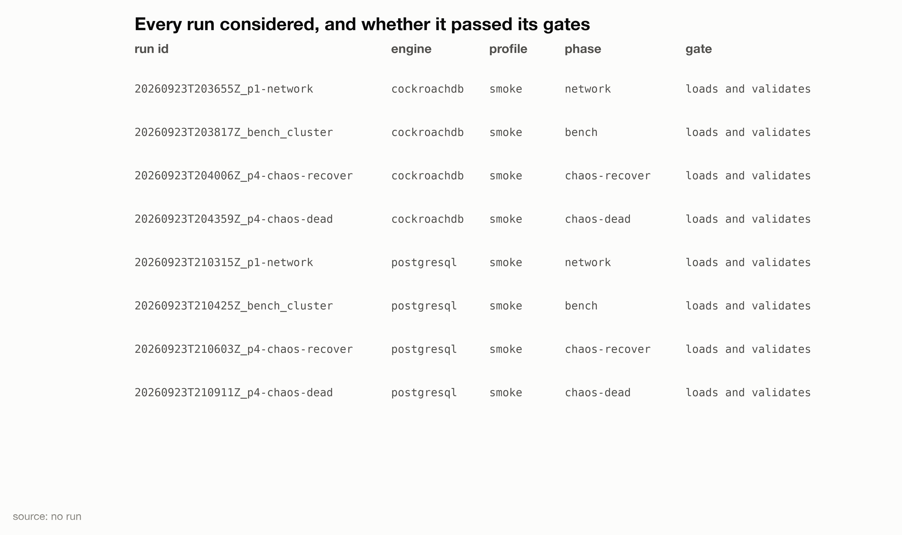

Every run directory this report considered. A run reaches a chart only by loading through the gated loader, which refuses anything without a manifest, with unexpected columns, or that fails pre-flight or validation -- so a run listed as refused here contributed to nothing in this document.

| metric | value |
|---|---|
| `runs_considered` | 8 |
| `runs_passing` | 8 |

### E4. Round-trip matrix

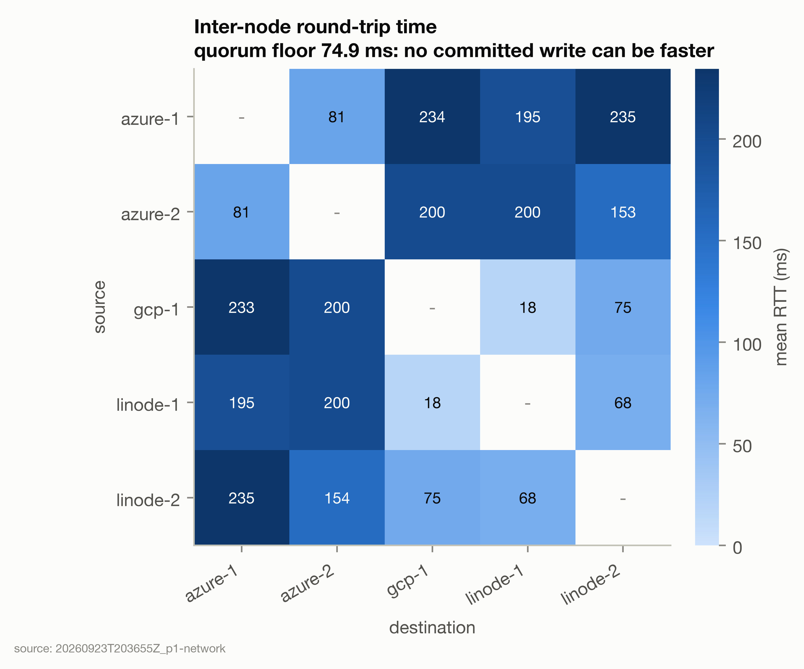

Mean round-trip time between every ordered pair of nodes, including the two neither E1 nor E2 puts on one axis with the rest: the non-gateway pairs. Darker is slower; a node does not ping itself, shown as a dash.

| metric | value |
|---|---|
| `quorum_floor_ms` | 74.91 |
